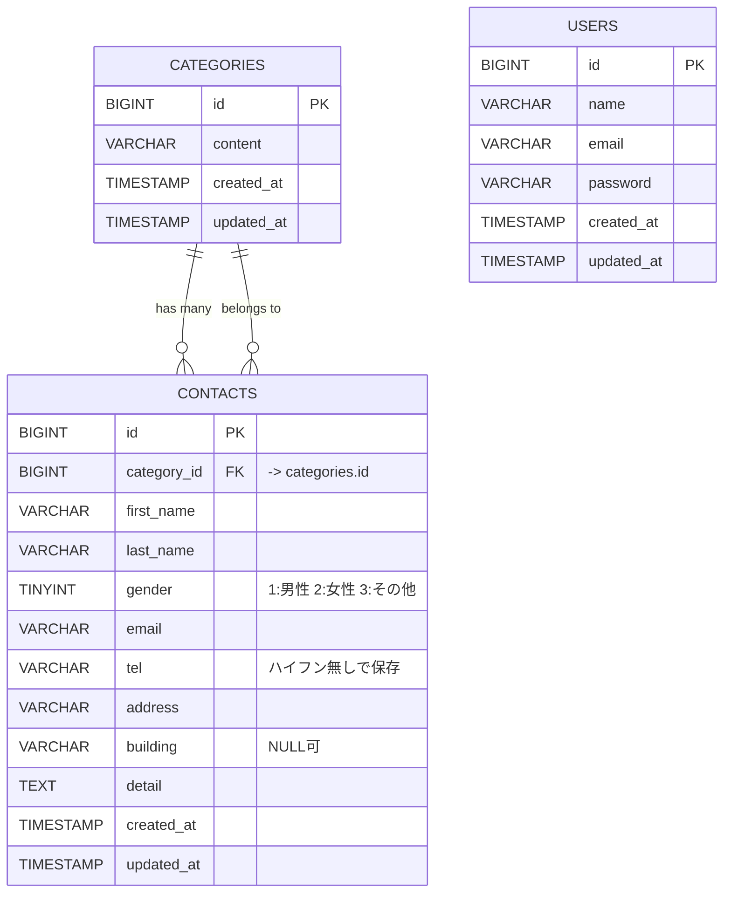

# お問い合わせフォーム（確認テスト）

## 環境構築
1.プロジェクト作成
composer create-project laravel/laravel contact-form
cd contact-form

2.GitHubリポジトリ作成
git init
git add .
git commit -m "first commit"
git branch -M main
git remote add origin https://github.com/hiro869/contact-form-test.git
git push -u origin main

3.Laravel sailインストール
php artisan sail:install
# → mysql を選択

4.Docker コンテナ起動
./vendor/bin/sail up -d

5.MySQL 起動確認
./vendor/bin/sail logs mysql --tail=100

6.Laravel セットアップ
.env 設定
DB_CONNECTION=mysql
DB_HOST=mysql
DB_PORT=3306
DB_DATABASE=laravel
DB_USERNAME=xxx
DB_PASSWORD=xxx
7.キャッシュクリア: ./vendor/bin/sail artisan config:clear

キー生成: ./vendor/bin/sail artisan key:generate

マイグレーション & シーディング
./vendor/bin/sail artisan migrate
./vendor/bin/sail artisan db:seed

## 使用技術（実行環境）

PHP 8.2

Laravel 12.x

MySQL 8.0

Docker / Laravel Sail

## ER図

## URL

開発環境: http://localhost

補足

課題の指示では「電話番号は5桁まで」とありましたが、
確認画面のイメージでは１１桁になっていましたので、
日本の一般的な電話番号仕様（固定電話は10桁、携帯は11桁）に合わせて、
10〜11桁の数字のみ を受け付ける仕様にしました。
エラーメッセージは電話番号は１０行または１１行の数字で入力してください。と出力されるようになっています。

ページ遷移について

本課題の概要には明記されていませんでしたが、以下のようにページ遷移を実装しています。
	•	登録後,ログアウト後：自動的に「入力ページ」に遷移します。
	•	ログイン中：ログイン画面や登録ページはアクセスできません。
	•	機能確認：再度ログイン画面や登録ページを確認する場合は、管理画面右上の ログアウトボタン を押してからご確認ください。
	•	管理画面：ログイン済みのユーザーのみがアクセス可能です。

